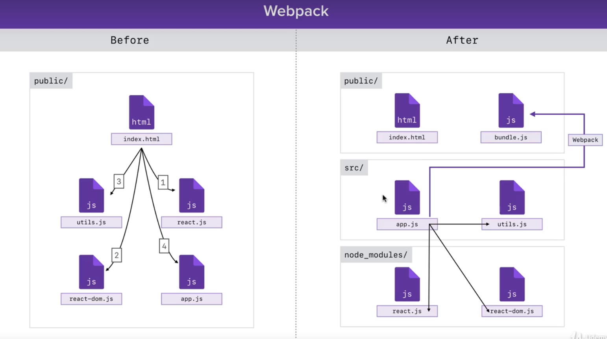
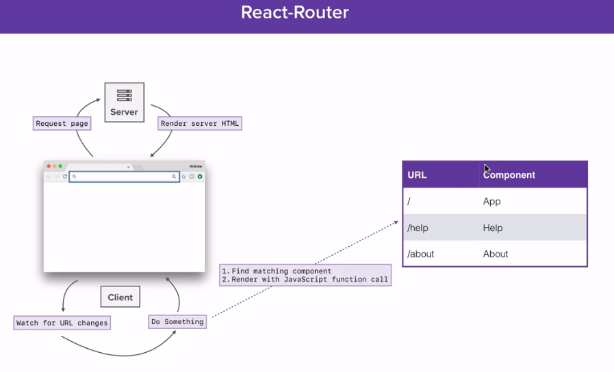

## Hello React

The Complete React Web Developer Course (with Redux)  

### Conditional JSX  

```bash
babel src/playground/es6-let-const.js --out-file=public/scripts/app.js --presets=env,react --watch
```

```javascript
var app = {
  title: 'tt',
  subtitle:'sb',
  options:['One', 'Two']
};
var user = {
  name: 'Andrew',
  age:26,
  location: 'zoo'
}
var templateTwo = (
  <div>
    {<h1>{app.title}</h1>}
    <p>{app.subtitle}</p>
    <p>{user.name ? user.name : 'Anonymous'}</p>
    {(user.age) &&(user.age >= 18) && <p>Age:{user.age}</p>}
    {/* <p>Location:{getLocation(user.location)}</p> */}
    {getLocation(user.location)}
    {(app.subtitle && <p>{app.subtitle}</p>)}
    {app.options.length > 0 ? <p>Here are your options</p> : <p>No options</p>}
  </div>
);
```

### Arrow function  

```javascript
const square = function (x) {
    return x * x;
}

console.log(square(8));

const squareArrow = (x) => {
    return x * x;
};

const getFirstName = (str) => str.split(' ')[0];
console.log(getFirstName('ha ah'));
```

'this' keyword no longer bound 

```javascript
var user = {
    name: 'Andrew',
    cities: ['Philadelphia', 'New York', 'Dublin'],
    //printPlacesLived: ()=> { doesnot work
    //
    //printPlacesLived() {
    printPlacesLived: function () {
        console.log(this.name);
        console.log(this.cities);
        /** 'this does not work'
         this.cities.forEach(function(city){
           console.log(this.name + city);
         });
         **/
        //arrow function works fine
        this.cities.forEach((city)=> {
          console.log(this.name + city);
        });
    }

};
user.printPlacesLived();

```

map function

```javascript
printPlacesLived: function () {
    const cityMessages = this.cities.map((city)=>{
        return city;
    })
    return cityMessages;
}
``` 

### Array of JSX  

1. render an array  
2. 'key' React之key详解 https://cnblogs.com/wonyun/p/6743988.html
```javascript
{app.option.length > 0 && 
          app.option.map((opt)=>{
            return <li key={opt}>{opt}</li>;
          })
        }

```   

### ES6 Class  

ES6 string  

```javascript
return `Hi I am ${this.name}`;
```  

Create class  

```javascript
class Person {
    constructor(name = 'Anonymous', age = 0) {
        // console.log('test');
        //refer to class instance
        this.name = name;
        this.age = age;
    }
    getGreeting() {
        // return 'I am' + this.name + 'Hi!';
        return `Hi I am ${this.name}`;
    }

    getDescription() {
        return `${this.name} is ${this.age} years old`;
    }
}

const me = new Person('QI WANG');
const other = new Person(undefined, 26);
console.log(me.getGreeting());
```  

Create subclasses  

```javascript
class Student extends Person{
    constructor(name, age, major) {
        super(name, age);
        this.major = major;
    }
    hasMajor() {
        return !!this.major;
    }

    getDescription() {
      //override method
        let description = super.getDescription();
        if (this.hasMajor()) {
            description += ` Their major is ${this.major}.`;
        }
        return description;
    }
}
```  

### Create React Component with ES6 and React  


```javascript
class Header extends React.Component {
  render() {
    return (
      <div>
        <h1>Indecision</h1>
        <h2>Put your life in the hands of a computer</h2>
      </div>
    );
  }
}

// dif between component VS html element
const jsx = (
  <div>
    <h1>
      Title
    </h1>
    <Header></Header>
  </div>
);

ReactDOM.render(jsx, document.getElementById('app'));

```

Put four component render in one component  

```javascript
class IndecisionApp extends React.Component {
  render() {
    return(
      <div>
        <Header></Header>
        <Action></Action>
        <Options></Options>
        <AddOption></AddOption>
      </div>

    )
  }
}
ReactDOM.render(<IndecisionApp/>, document.getElementById('app'));
```  

### Component Props   

Data like the '<Header></Header>' title  

```javascript
class Options extends React.Component {
  render() {
    return (
      <div>
        Options Component here!
        {/* {this.props.options.length} */}

        {
          //no curly braces
          this.props.options.map((option) => 
          <p key={option}>{option}</p>)
          
        }
      </div>
    );
  }
}
```  

### Events & Methods   

1. handleOption函数有参数  

```javascript
class AddOption extends React.Component {

  handleAddOption(e) {
    e.preventDefault();
    const option = e.target.elements.option.value.trim();
    if (option) {
      alert(option);
    }
  }
  
  render() {
    return (
      <div>
        <form onSubmit={this.handleAddOption}>
          <input type="text" name="option"></input>
          <button>AddOption component here</button>
        </form>          
      </div>
    );
  }
}
```  

### Method binding  
‘this’ callback 问题，解决方案 https://medium.freecodecamp.org/react-binding-patterns-5-approaches-for-handling-this-92c651b5af56  
mdn bind

```javascript
const obj = {
  name: 'Vikram',
  getName() {
    return this.name;
  }
};

const getName = obj.getName.bind(obj);
console.log(getName());
```  

1. even handler loose binding  
2. override constructor function for React component

```javascript
//binding
class Options extends React.Component {

  handleRemoveAll() {
    // this.props.options = [];
    alert('remove');
  }

  render() {
    return (
      <div>
        
        <button onClick={this.handleRemoveAll.bind(this)}> Remove All</button>
        {
          //no curly braces
          this.props.options.map((option) => 
          <Option key={option} optionText={option}/>)
          
        }
      </div>
    );
  }
}
```   

constructor function  

```javascript
constructor(props) {
    super(props);
    this.handleRemoveAll = this.handleRemoveAll.bind(this);
  }
```

### Component State  

1. Setup default state object
2. Component rendered with default state values  
3. Changes state based on event  
4. Component re-rendered using new state values  
5. Start again at 3

#### Part I add stste to counter app 

  create funcions and bind 

```javascript
class Counter extends React.Component {
  constructor(props) {
    super(props);
    this.handleAddOne= this.handleAddOne.bind(this);
    this.handleMinusOne = this.handleMinusOne.bind(this);
    this.handleReset = this.handleReset.bind(this);
  }
  handleAddOne() {
    alert()
  }
  handleMinusOne() {

  }
  handleReset() {

  } 
  render() {
    return (
      <div>
        <h1>Count: </h1>
        <button onClick={this.handleAddOne}>+1</button>
        <button onClick={this.handleMinusOne}>-1</button>
        <button onClick={this.handleReset}>reset</button>
      </div>
    );
  }
}

ReactDOM.render(<Counter/>, document.getElementById('app'));
```

#### Part II  

use setState function, 'prevState' 参数(optional), return an object  

```javascript
handleMinusOne() {
    this.setState((prevState)=>{
      return {
        count: prevState.count - 1
      };
    });
  }
```  

#### Alternative ways setState  

Without using setState function has asynchronous problem. Useing update function is better.

#### Indecision State Part I  

Reverse data flow  
Parents ----------(pass function to cild)-----------> Child  
           <--(change parents state through function)  

```javascript
<Options 
          options={this.state.options}
          handleDeleteOptions={this.handleDeleteOptions}
        ></Options>
```  

#### Indecision State Part II  

concat增加数组元素  

```javascript
handleAddOption(option) {
    // console.log(option);
    this.setState((prevState)=> {
      return {
        options: prevState.options.concat([option]) 
      };
    });
  }
```  

error也要写进state更新  

```javascript
constructor(props) {
    super(props);
    this.handleAddOption = this.handleAddOption.bind(this);
    this.state = {
      error: undefined
    };
  }
```  

### Stateless functional components 

When components do not have state attributes. Faster, end easy to use.

```javascript
//no 'this' words
const User = (props) => {
  return (
    <div>
      <p>Name: {props.name}</p>
      <p>Age: </p>
    </div>
  );
};

ReactDOM.render(<User name="Andrew"/>, document.getElementById('app'));
```

#### Set default values for component  

defaultProps value send to props.  
Get data through prop, do not use this.

```javascript
const Header = (props) => {
    return (
      <div>
        <h1>{props.title}</h1>
        {props.subtitle && <h2>{props.subtitle}</h2>}
      </div>
    );
};

Header.defaultProps = {
  title: 'Indecision'
};
```  

```javascript
this.state = {
  options: props.options,
};

IndecisionApp.defaultProps = {
  options: []
};
  
```

also give value in the tag  

```javascript
ReactDOM.render(<Counter count={-10}/>, document.getElementById('app'));
```  

### Debug using extension  

### Implicit return object when setState  

original method  

```javascript
handleDeleteOptions() {
  this.setState(()=>{
    return {
      options:[]
    };
  });
}
```  

implicit method  

```javascript
handleDeleteOptions() {
    // this.setState(()=>{
    //   return {
    //     options:[]
    //   }; 
    // });
    this.setState(() => ({options:[]}) );
  }
``` 

### Remove individual Option  

Define inline arrow function  

### Lifecycle Methods  

```javascript
componentDidMount() {
  console.log('fetching data');
}
componentDidUpdate(prevProps, prevState) {
  console.log('saving data!');
}
componentWillUnmount() {
  console.log('componentWillUnmount');
}
```  

keep data on the page after refeshing  

```javascript
componentDidMount() {
  //deal with invalid json parse arguemnt
  try{
    const json = localStorage.getItem('options');
    const options = JSON.parse(json);
    if (options) {
      this.setState(()=>({
        options: options
      }));
    }
  } catch(e) {
    //Do nothing
  }
  
}
componentDidUpdate(prevProps, prevState) {
  if (prevState.options.length !== this.state.options.length) {
    //convert object to string
    const json = JSON.stringify(this.state.options);
    //store key value pair to localStorage
    localStorage.setItem('options', json);
    console.log('saving data');
  }
}
componentWillUnmount() {
  console.log('componentWillUnmount');
}

```

### LocalStorage  

Keep data in (key, value) pair  
only supports string  
Directly used with one variable  
When using object, Use JSON.parse() and JSON.stringify()  


### Webpack   

  

1. expose something(object) to another file.

```json
module.exports = {
  
};
```  

2. can remove public/scripts/app.js  
3. remove src links in index.html
4. change src to bundle

```html
<!-- <script src="/scripts/app.js"></script> -->
<script src="/bundle.js"></script>
```

#### break to multiple files  

exports  
1.default export   
can use without use the same name  
cannot do with const variable  

```javascript
const substract = (a, b) => a - b;
export{ substract as default};

import substractIWant from './utils.js'
console.log(substractIWant(100, 3)); 

//or
export default (a, b) => a - b; 

//WRONG!!
export default const Option = (props) => {  
//Work
export default (props) => {
```  

2.name exports   

```javascript
const square = (x) => {
   return x * x;
}

export {square};
// or useing
export const square = (x) => {
   return x * x;
}
```

import the exports variable from file

```javascript
import {square} from './utils.js';

```  

#### import npm modules  

install -> import -> use

#### use babel with webpack  

1. loader: deal with a file
2. install babel-core to run using webpack
3. set module in webpack.config.js
4. add .babelrc for babel using env & react  

### One component per file  

1. Create file Option.js, AddOption.js.. 
2. import React in js files, <b>MUST</b>, all code convert to React.creatclass calls
3. export component  

1. Moving the componentcode  
2. Setup import/export  
3. Move the imports to new file

#### Source map with webpack  

'devtool' define type of the source map  

#### webpack dev server  

package.json uses the configuire in the webpack.config.js  
webpack do not directly use bundle.js under public file, otherwise, serve from memory. Fast  

To build bundle.js  

```bash
yarn run build
```  

#### Use babel plugin to simplify the code  

1. pull the state out of constructor  
2. use arrow functions, do not need bind in constructor  
3. delete the constructor  

### React model: third party component  

#### Modal can show in dynamic way  

### Styling React

#### Set up webpack for SCSS  

1. test: files end with css  
2. install : css-loader; style-loader 
3. import file into app.js  

#### rem: set size toll  

set scss: blocks(Header),
elements: title  

#### Normalize.css  

see same style in Chrome or Firefox

support both css and scss  

```js
 {
    test: /\.s?css$/,
    use:[
        'style-loader',
        'css-loader',
        'sass-loader'
    ]
}]
```  

#### Write scss & import the style values  

$off-white;

align center

```css
.container {
    max-width: 60rem;
    margin: 0 auto;
    padding: 0 $m-size;
}
```  
sass reference functions: built in function of scss.  
BEM: block, element, modifier  

#### styling Options  

- set up selector for widget-header
- set margin
- use the class

```scss
.widget-header__title {
    margin: 0;
}
```  

```js
<div className="widget-header">
          <h3 className="widget-header__title">Your Options</h3>
```

使用map的index  

```js
props.options.map((option, index) => 
    <Option 
    key={option} 
    optionText={option}
    count={index + 1}
    handleDeleteOption={props.handleDeleteOption}
    />)
```  

#### styling react modal  

under _modal.scss  
ReactModalPortal do not need to add it to className.

```js
.ReactModalPortal > div {
    opacity: 0;
}

.ReactModalPortal .ReactModal__Overlay {
    align-items: center;
    display: flex;
    justify-content: center;
    transition: opacity 200ms ease-in-out;
}

.ReactModalPortal .ReactModal__Overlay--after-open {
    opacity: 1;
}

.ReactModalPortal .ReactModal__Overlay--before-close {
    opacity: 0;
}

.modal {
    background: $light-blue;
    color:white;
    max-width: 30rem;
    outline: none;
    padding: $l-size;
    text-align: center;
}

.modal__title {
    margin: 0 0 $m-size 0;
}

.modal__body {
    font-size: 2rem;
    font-weight: 300;
    margin: 0 0 $l-size 0;
    word-break: break-all;
}
```  

change for mobile device  

```js
@media (min-width: 45rem) {
    .add-option {
        flex-direction: row;
    }
    .add-option__input {
        margin:0 $s-size 0 0;
    }
}
```  

### React-Router

use client side server without roundtrip to server and then return to client to re-render. Use html5 API detact the URL changes. -> render a new component to screen.

1. set URL corresponding to component
2. dins matching component  
3. Use javascript function call to render  

  

#### condig react- router  

react-router training 
https://github.com/ReactTraining/react-router  

install react-router-dom

#### add multiple pages  

```js
import {BrowserRouter, Route} from 'react-router-dom';

const routes = (
    <BrowserRouter>
        <div>
            <Route path="/" component={ExpenseDashboardPage} exact={true}/>
            <Route path="/create" component={AddExpensePage}/>
        </div>
    </BrowserRouter>
);

ReactDOM.render(routes, document.getElementById('app'));
```  
set client side routing. webpack.js

```js
historyApiFallback: true
```


